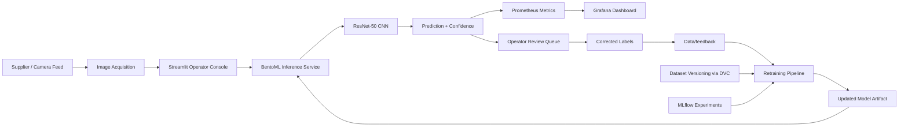

# Architecture and Data Flow

## Overview

The system follows a production-style machine-learning pipeline for visual quality inspection. It begins with dataset preparation, tracks dataset versions with DVC, trains a transfer-learning classifier, serves the model with BentoML, and exposes monitoring metrics to Prometheus and Grafana. Human operators review misclassifications and add corrected labels to the feedback loop.

## High-level architecture

## 1. Data layer

The project uses synthetic casting images generated from a procedural image generator. Each sample is labeled as either `ok` or `defective`. The dataset is stored under `data/raw/train` and `data/raw/test` and tracked through DVC metadata files in `.dvc/` and `data/raw.dvc`.

### Data versioning strategy

- baseline images are committed through DVC metadata
- new samples from operator feedback are collected in `data/feedback/`
- feedback is merged back into training batches during each retraining cycle
- model and data snapshots are tied back to MLflow experiment runs for traceability

## 2. Training layer

The training pipeline in `src/train.py` does the following:

1. loads the raw dataset from the configured folders
2. applies image augmentation and normalization
3. creates a ResNet-50 classifier with a custom binary head
4. freezes the pretrained backbone and fine-tunes the final layer
5. logs metrics to MLflow
6. saves the model weights to `models/model.pth`

The training objective is binary classification:

- class 0 = `defective`
- class 1 = `ok`

## 3. Serving layer

The BentoML service in `src/serve.py` loads the saved model and exposes a `predict` API that accepts an image and returns:

- label
- confidence score
- latency in seconds
- status

Metrics are exported through Prometheus counters and histograms:

- `inference_requests_total`
- `inference_latency_seconds`
- `prediction_confidence`

## 4. Monitoring and observability

Prometheus scrapes the inference endpoint on a fixed interval and stores application-level metrics. Grafana visualizes:

- throughput (requests per second)
- p95/p99 latency
- confidence distribution
- prediction counts by label

This helps the production team watch model health, queue pressure, and prediction quality in near-real time.

## 5. Human-in-the-loop feedback

The Streamlit app in `src/app.py` gives operators a review queue, where they can:

- inspect logged predictions
- inspect the uploaded image
- correct a label as `ok` or `defective`
- save the corrected label to the feedback dataset

Corrected labels are copied into `data/feedback/` and are then included in subsequent retraining cycles.

## 6. Retraining cadence

A practical cadence for the use case is:

- daily or shift-based retraining for small batches of corrections
- retraining after a threshold of corrected samples is collected
- model comparison before and after active-learning updates

The training pipeline is designed so each retraining run can incorporate operator feedback without requiring a full dataset rebuild.

## 7. Edge deployment considerations

The service is containerized with Docker and is designed for portable edge deployment. The Docker image is intentionally multi-arch friendly and supports ARM-style deployment patterns common in machine-vision environments such as Raspberry Pi or industrial edge gateways.

### Deployment considerations

- keep model size small and inference optimized
- run on CPU-only edge hardware when necessary
- keep telemetry enabled for fleet monitoring
- store model registry versions centrally for rollback

## 8. Operational readiness

This implementation is aligned with typical production requirements:

- reproducible model training through versioned data and MLflow runs
- model artifacts retained in a registry-friendly layout
- instrumentation for latency, confidence, and throughput
- operator-driven feedback loop for retraining
- containerization for consistent deployment

## Risks and mitigations

- Data drift: monitor confidence and misclassification rates; trigger model review when distribution shifts
- Label noise: require operator review and store corrected labels separately from production data
- Edge constraints: optimize batch sizes and model freezing strategy for CPU-only devices
- Model rollback: keep MLflow runs and model weights versioned for rapid restore
