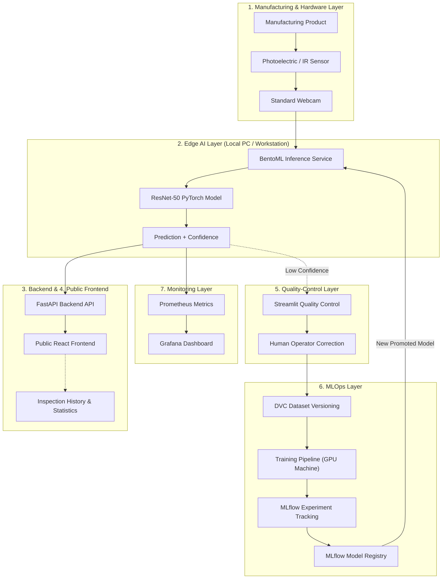
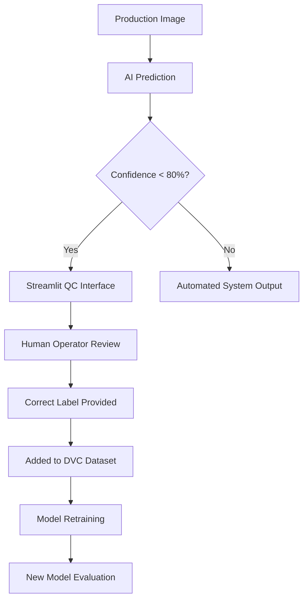

# Visual Quality Inspection System - Architecture & Implementation

This document details the complete end-to-end architecture of our **TCS Industry-Aligned Capstone Project (Use Case B)**.

## 1. Project Overview & Main Objectives

Our system automates the visual inspection of manufacturing components to identify defects with high precision. By combining Edge AI, MLOps, and Human-in-the-Loop Active Learning, the solution ensures continuous improvement.

**Key Technologies**:
- **Computer Vision Model**: ResNet-50 using PyTorch
- **Dataset**: Casting Product Defect Dataset
- **Edge Inference**: Local PC / Workstation + BentoML
- **MLOps Lifecycle**: DVC (Data Versioning) + MLflow (Experiment Tracking & Registry)
- **Monitoring**: Prometheus + Grafana
- **Web Interfaces**: React (Public Frontend) + Streamlit (QC Interface)

---

## 2. Complete End-to-End System Architecture



---

## 3. Physical Inspection Station (Edge)

The physical prototype simulates a production line:
- **Conveyor Belt**: Moves products through the zone (DC geared motor).
- **Photoelectric Sensor**: Triggers the camera to avoid continuous unnecessary processing.
- **Standard Webcam**: Captures crisp images of moving components.
- **LED Lighting**: Ensures consistent illumination to avoid shadows and reflections.
- **Local PC / Workstation**: Runs the BentoML Docker container for real-time inference.

---

## 4. Computer Vision Model & Training Infrastructure

We utilize **Transfer Learning** with a pretrained **ResNet-50** architecture implemented in PyTorch. The classification layer is modified to output binary predictions: `0 = DEFECTIVE`, `1 = OK`.

**Training Infrastructure Division**:
- **GPU-enabled Machine**: Handles dataset preprocessing, augmentation, hyperparameter tuning, and computationally intensive training.
- **Local PC (Edge)**: Strictly handles low-latency model inference.

---

## 5. MLOps: Versioning, Tracking, and Registry

- **DVC (Data Version Control)**: We version the baseline dataset (`Dataset V1`). When human feedback is collected, a new version (`Dataset V2`) is created and tied cryptastically to the model trained on it.
- **MLflow Experiment Tracking**: Tracks metrics such as Accuracy, Precision, Recall, F1 Score, and Inference Latency for every run.
- **MLflow Model Registry**: Enforces a lifecycle of `Training → Evaluation → Staging → Production`. A model is only promoted if its evaluation metrics beat the current production model.

---

## 6. Model Serving & Deployment

The trained PyTorch model is wrapped in **BentoML** to create a production-ready REST API. The inference service is containerized using **Docker** for containerized deployment, allowing seamless deployment onto the Local PC.

---

## 7. Frontend, Backend, and Monitoring

- **FastAPI Backend**: Acts as the central nervous system, managing prediction history, image storage, and system status endpoints.
- **React Public Frontend**: Displays real-time inspection results, system status, and aggregate statistics for public viewing.
- **Prometheus & Grafana**: Prometheus scrapes inference latency, confidence distribution, and prediction counts from BentoML and FastAPI. Grafana visualizes these in an operational dashboard.

---

## 8. Human-in-the-Loop Active Learning Workflow

Instead of discarding uncertain predictions, we implement an active-learning feedback loop:



---

## 9. Logical Software Architecture

Our repository strictly follows the required logical architecture:

```text
visual-quality-inspection/
|
+-- frontend/
|   +-- public-web-application
|
+-- backend/
|   +-- API
|
+-- inference/ (BentoML Serving)
|
+-- training/ (ML Pipeline & ResNet)
|
+-- feedback/ (Streamlit QC)
|
+-- monitoring/
|   +-- Prometheus
|   +-- Grafana
|
+-- data/
+-- models/
+-- tests/
+-- docker/
+-- dvc.yaml
+-- docker-compose.yml
+-- README.md
```
